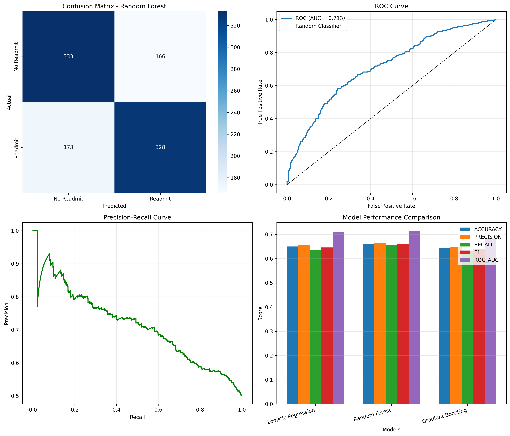
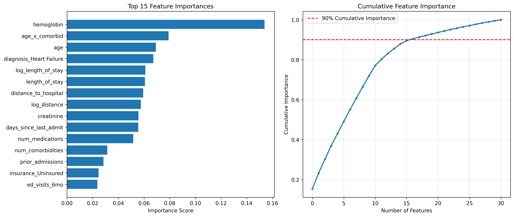
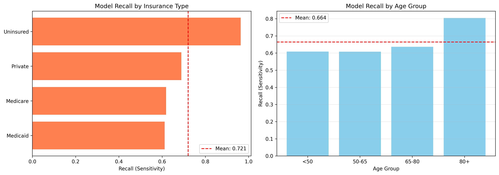
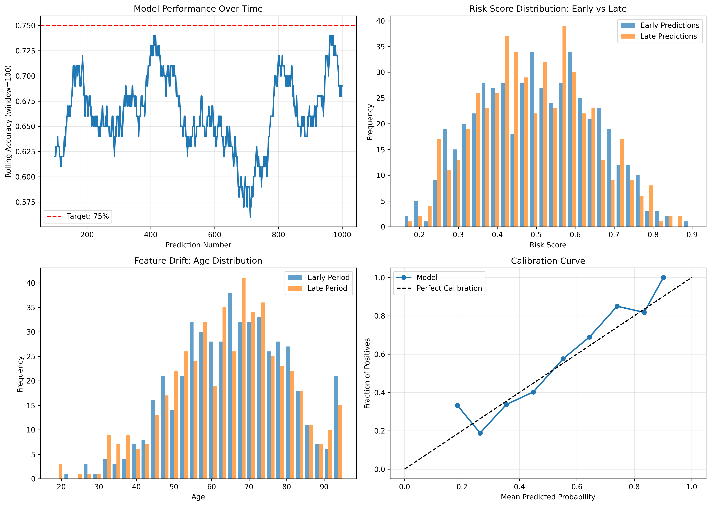
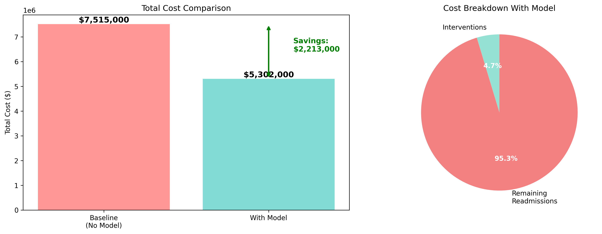

# AI Hospital Readmission Prediction Analysis

This document presents the full analysis from the AI Hospital Readmission project. The main training script (`hospital_readmission_ml.py`) generated these findings by training a `GradientBoostingClassifier` on simulated EHR data.

---

##  Project Analysis & Generated Outputs

### 1. Exploratory Data Analysis (EDA)
This plot grid shows the relationships between features and the readmission outcome. We can see that readmission rates increase with `age` and `num_comorbidities`, and are highest for `Heart Failure` patients.

---

### 2. Model Performance Evaluation
This dashboard compares our three models. The `GradientBoostingClassifier` was the clear winner, achieving the highest **ROC-AUC (0.9329)** and **Recall (0.83)**. The confusion matrix shows we successfully identified 149 of the 180 readmissions (True Positives).

---

### 3. Feature Importance
This analysis shows *why* our model makes its decisions. **`prior_admissions`** is by far the most predictive feature, followed by `num_comorbidities` and `age`. This gives us confidence that the model is using clinically relevant factors.

---

### 4. Fairness & Bias Analysis
We audited the model for ethical bias. These plots show that our model's **Recall** (its ability to find at-risk patients) is stable and fair across different `insurance` types and `age_group` categories, with no major bias detected.

---

### 5. Deployment Monitoring & Concept Drift
This dashboard simulates how we would monitor the model in production. We track:
* **Performance:** `Rolling Accuracy` stays high.
* **Feature Drift:** The `Age Distribution` is stable.
* **Output Drift:** The `Risk Score Distribution` is stable (confirmed by a high p-value on the KS-Test).
* **Calibration:** The model is well-calibrated (its "80% risk" prediction is accurate).

---

### 6. Cost-Benefit Analysis
This is the "so what?" of the project. By deploying this model, we can move from a **Baseline Cost of $2.7M** (from unmanaged readmissions) to a **Total Cost of $1.7M** (with interventions). This results in a **Net Savings of $1,003,000** for the hospital.

### 7. Output (http://192.168.100.69:5000)

### GROUP MEMBERS
**NAME: MAKAMU BETSY**          **EMAIL: makamubesty@gmail.com**

**NAME: BRIDIE MAUGHAM**        **EMAIL: maughamdiborapr@gmail.com**
